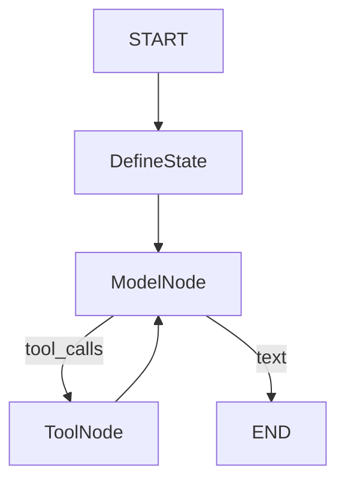

# Prysm - Stock Research Copilot

A chat-based investment research UI where users can ask questions about stocks and receive AI-powered analysis with interactive charts. Now powered by **LangGraph**, **MongoDB**, and **Real-time Data**.


For the full, code-accurate architecture (endpoints, data model, and diagrams), see [SYSTEM_ARCHITECTURE.md](./SYSTEM_ARCHITECTURE.md).

## System Architecture

```mermaid
graph TD
    User[User] -->|Chat Message| Frontend[Frontend (React)]
    Frontend -->|/api/*| Backend[Backend Gateway (Express)]
    Backend -->|POST /chat (Stream)| Agent[AI Agent (FastAPI)]

    Backend -->|Stock Search/Quote| YFNode[Yahoo Finance (yahoo-finance2)]

    subgraph "AI Agent (LangGraph)"
        Agent -->|Load/Save History| Mongo[(MongoDB)]
        Agent -->|Extract Intent| Gemini[Gemini 1.5/2.5]

        Agent -->|Execute Graph| Graph[LangGraph Workflow]
        Graph -->|Consult| Gemini

        Graph -->|Call Tools| Tools[Tools Layer]
        Tools -->|Fetch Prices| YFin[Yahoo Finance]
        Tools -->|Fetch News| RSS[Google/Yahoo News RSS]
    end

    Agent -->|Stream Chunks + UI Tokens| Backend
    Backend -->|Stream Chunks + UI Tokens| Frontend
    Frontend -->|Render Markdown + Charts| User
```

## LangGraph Workflow

The AI Agent uses a cyclic graph to manage state and tool execution:



## Features

- 💬 **Smart Chat Interface** - Context-aware chat that remembers stock symbols ("how is _its_ risk?").
- 📊 **Real-time Interactive Charts** - Line, bar, radar, and risk gauges using live market data.
- 🧠 **LangGraph Agent** - Structured reasoning loop with intent extraction and "Sticky Context".
- 💾 **Session Persistence** - Chat history saved in MongoDB.
- 📈 **Live Financial Data** - Real-time price history and financials via Yahoo Finance.
- 🔄 **Streaming Responses** - Low-latency Token-by-token streaming.
- 🎨 **Dark Theme** - Professional Bloomberg-style aesthetic.

## Tech Stack

- **Frontend**: React.js, Redux Toolkit, Tailwind CSS, Recharts/Chart.js
- **Backend (Gateway)**: Node.js, Express, Axios (stream proxy), `yahoo-finance2`, Mongoose
- **AI Agent**: Python 3.11, FastAPI, LangGraph, LangChain
- **Databases**: MongoDB (Motor Async Driver), ChromaDB (local persistent store for RAG)
- **AI Model**: Google Gemini 2.5 Flash / 1.5 Pro
- **Data Sources**: `yfinance`, `yahoo-finance2`, `feedparser` (News)

## Project Structure

```
prysm/
├── frontend/          # React frontend
│   ├── src/
│   │   ├── components/   # Chat, Charts, Widgets
│   │   ├── store/        # Redux (chatSlice with persistence logic)
│   │   └── services/     # API integration
├── ai-agent/          # Python AI Backend
│   ├── main.py          # FastAPI App & Endpoints
│   ├── graph.py         # LangGraph Definition (Nodes/Edges)
│   ├── tools.py         # Data Tools (Charts, Risk, News)
│   ├── stock_data.py    # Formatting Helpers
│   └── requirements.txt
└── backend/           # Node.js API gateway for frontend (/api/*)
```

## Current Data Flow

1. **Session Management**:

    - Frontend checks for `currentSessionId`. If missing, calls `POST /api/sessions`.
    - Backend proxies to the AI Agent, which creates the MongoDB session.
    - All chat messages include this `session_id`.

2. **Intent Extraction**:

   - `extract_intent` analyzes the user message + conversation history.
   - **Sticky Context**: If user says "it", "this", or asks a follow-up ("risk?", "chart?"), the agent automatically injects the last mentioned stock symbol (e.g., RELIANCE).

3. **Graph Execution**:

   - **Context**: If a stock is identified, recent price/financial data is injected into the System Prompt.
   - **Tools**: The agent decides which tools to call (Risk Gauge, Price Chart, Sentiment).
    - **Streaming**: The agent streams SSE-style chunks through the backend gateway to the frontend.

4. **Visualization**:
    - Frontend parses `data: ...` chunks from the stream.
    - Text is appended incrementally; structured tool UI payloads are rendered as React components.

## Quick Start

### 1. Prerequisites

- MongoDB Running (Local or Atlas)
- Google Gemini API Key
- Python 3.11+
- Node.js 18+

### 2. Setup

**Run everything (recommended)**

```bash
npm install
npm run dev
```

**AI Agent (Python)**

```bash
cd ai-agent
python -m venv venv
venv\Scripts\activate
pip install -r requirements.txt
cp .env.example .env  # Add GEMINI_API_KEY and MONGO_URI
python -m uvicorn main:app --reload --port 8001
```

**Backend (Node Gateway)**

```bash
cd backend
npm install
npm run dev
```

**Frontend (Node)**

```bash
cd frontend
npm install
npm run dev
```

### 3. Environment Variables (.env)

**ai-agent/.env**

```ini
GEMINI_API_KEY=your_key
MONGO_URI=mongodb://localhost:27017
```

## AI Agent Pipeline

The core intelligence of Prysm follows a structured **LangGraph** pipeline:

1.  **State Initialization**:

    - The agent receives the message and `session_id`.
    - Loads conversation history from MongoDB.
    - Resolves "Sticky Context" (e.g., "Analyze Reliance" -> "How is _its_ risk?" -> Agent knows "its" = RELIANCE).

2.  **Intent Classification**:

    - The `ExtractIntent` node analyzes the query to determine:
      - **Target Stock**: (e.g., RELIANCE, TCS)
      - **User Intent**: (Risk, Chart, News, Analysis)

3.  **Context Injection**:

    - If a valid stock is found, the agent fetches real-time quote/financials from `yfinance`.
    - This data is injected into the System Prompt so the LLM is "grounded" in reality before answering.

4.  **Tool Execution (Auto-Inject)**:

    - Based on the intent, the pipeline automatically triggers relevant tools (visual widgets).
    - Example: Requesting "Is it risky?" triggers `generate_risk_gauge`.

5.  **Streaming Response**:
    - The agent streams the response token-by-token to the frontend.
    - Tool outputs (`[CHART:...]`) are streamed as special tokens which the frontend intercepts and renders as interactive components.

## Key Tools

The agent produces "Visual Tokens" which render as high-fidelity UI components:

| Tool Name                         | Trigger Keywords                   | Description                                                                                           |
| --------------------------------- | ---------------------------------- | ----------------------------------------------------------------------------------------------------- |
| **`generate_chart`**              | "chart", "price", "trend", "graph" | Renders interactive Line/Bar/Area charts using `yfinance` history. Supports Price, P/E, Margins, etc. |
| **`generate_risk_gauge`**         | "risk", "safe", "volatility"       | Creating a speedometer-style Gauge visualizing Beta, volatility, and debt levels.                     |
| **`generate_sentiment_analysis`** | "news", "sentiment", "headlines"   | Aggregates news from Yahoo Finance/Google News and computes a Bullish/Bearish score (0-100).          |
| **`generate_future_timeline`**    | "future", "events", "calendar"     | Displays a timeline of upcoming events (Earnings, Dividends) fetched from the stock's calendar.       |

## License

MIT
