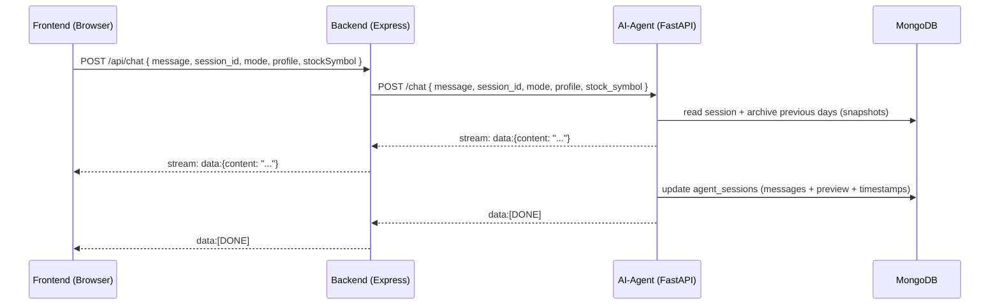

# Prysm — System Architecture

This document describes Prysm’s full runtime architecture (frontend, backend gateway, AI agent, data stores, and external integrations) based on the current code in this repo.

## 1) High-level overview

Prysm is a 3-service local dev stack:

- **Frontend (React/Vite)**: Chat + visual components (charts/risk/timeline/sentiment/compare) and session sidebar. Sends chat requests and renders streamed responses.
- **Backend (Node/Express)**: API gateway for the frontend. Proxies chat/session traffic to the AI agent and provides stock endpoints.
- **AI Agent (FastAPI)**: Streaming LLM agent with LangGraph + tool calling. Persists sessions to MongoDB. Optional PDF-RAG ingestion/query via ChromaDB.

### Topology

```mermaid
graph LR
  U[User Browser] -->|HTTP| FE[Frontend: Vite + React]
  FE -->|/api/*| BE[Backend: Express API Gateway]
  BE -->|/chat /sessions| AG[AI-Agent: FastAPI + LangGraph]

  BE -->|yahoo-finance2| YF[(Yahoo Finance APIs)]

  AG -->|Motor| MDB[(MongoDB: prysm.agent_sessions)]
  AG -->|Chroma persistent| CH[(ChromaDB: ai-agent/chroma_db)]
  AG -->|LLM calls| LLM[(Gemini API)]
  AG -->|yfinance + scraping fallback| YF2[(Yahoo Finance / Google Finance)]
  AG -->|RSS/news feeds| NEWS[(RSS Sources)]

  FE -->|direct PDF upload (current)| AG
```

### Default local ports

- Frontend (Vite): typically `http://localhost:5173`
- Backend (Express): `http://localhost:8000`
- AI Agent (FastAPI/uvicorn): `http://localhost:8001`

(Ports are driven by workspace scripts and each service’s config.)

## 2) Service responsibilities

### 2.1 Frontend (React)

**Primary responsibilities**
- Collect user input: message text, mode/profile selectors, selected stock, attachments.
- Dispatch chat requests to the backend.
- Parse streamed SSE-style chunks and render them incrementally.
- Render “visual tool output” returned by the agent (charts/risk gauges/timelines/tables/cards).
- Manage sessions list and current session state.

**Key UI domains**
- Chat UI: input box, message list, welcome screen.
- Stock selection UI: chooses `selectedStock` in Redux.
- Chart renderer components: take tool output payloads and display.

### 2.2 Backend (Node/Express) — API Gateway

**Primary responsibilities**
- Provide a stable `/api/*` surface for the frontend.
- Proxy streaming chat from AI Agent `/chat` to frontend `/api/chat`.
- Proxy sessions from AI Agent `/sessions` to frontend `/api/sessions`.
- Provide stock search/detail endpoints under `/api/stock/*` (powered by `yahoo-finance2`).
- Connect to MongoDB via Mongoose (configured by `MONGO_URI`).

**Note on storage**
- The AI Agent is the source of truth for chat sessions (`agent_sessions`).
- The backend contains a `ChatHistory` model but current app behavior relies on the agent’s session storage for chat history.

### 2.3 AI Agent (FastAPI + LangGraph)

**Primary responsibilities**
- Handle `/chat` streaming responses.
- Use LangGraph to run an LLM agent capable of tool calling.
- Persist sessions and metadata to MongoDB (`prysm.agent_sessions`).
- Archive previous-day messages into daily `snapshots[]` to keep sessions lightweight.
- Handle PDF ingestion (`/upload_doc`) and RAG query (`consult_knowledge_base` tool).

**Agent capabilities (tools)**
- Stock chart generation
- Risk gauge generation
- Future timeline generation
- Sentiment analysis
- Stock comparison
- RAG lookup against uploaded PDFs

## 3) Core runtime flows

### 3.1 Chat streaming (end-to-end)

The system uses an SSE-like format across services:

- AI Agent produces `text/event-stream` where each message chunk is:
  - `data: {"content": "..."}\n\n`
  - and ends with `data: [DONE]\n\n` (consumer expects a sentinel)
- Backend proxies the stream to the frontend.
- Frontend parses `data:` lines and appends content incrementally.



### 3.2 Stock selection as context (mode-aware)

Frontend sends the selected stock symbol along with each chat request.

The AI Agent treats this symbol in two different ways:

- **Stock mode**: the selected symbol is *enforced* as the active analysis ticker.
- **Overall mode**: the selected symbol is used as *contextual default* only when the user’s question is stock-specific but doesn’t name a ticker (e.g., “Is it overvalued?” right after selecting HDFCBANK). If the user is asking general/portfolio questions, the agent should not force the answer to be about the selected symbol.

This logic is implemented in the AI agent’s system prompt assembly.

### 3.3 Tool invocation → UI output

During a chat, the agent can call tools via LangGraph. When a tool returns UI payloads, they are streamed back as additional `data: {"content": ...}` chunks.

- The frontend treats some streamed chunks as “UI blocks” (e.g., JSON arrays/objects representing chart specs or component payloads) and renders them via specialized components.
- The agent can interleave normal text tokens and tool UI payloads in the same stream.

### 3.4 Sessions + sidebar preview

- Sessions are stored in MongoDB by the AI Agent.
- The backend’s `/api/sessions` proxies the agent’s sessions endpoints.
- Sessions are returned sorted by `updated_at`.
- Each session stores:
  - `title`: shown in sidebar
  - `preview`: derived from the latest user message and shown as a subtitle/preview

### 3.5 Daily snapshots (message compaction)

To prevent sessions from growing indefinitely:

- Before adding new turns, the AI Agent archives messages from **previous UTC days** into `snapshots[]`.
- Messages from previous days are removed from `messages` after archiving.
- Each snapshot includes `date`, `summary`, `message_count`, `created_at`.

This helps keep retrieval fast while preserving a compact history.

### 3.6 Stock data retrieval

There are two stock-data “layers” in the project:

- **Backend stock endpoints** (`/api/stock/*`) use `yahoo-finance2` and normalize Indian tickers (e.g., `HDFCBANK` → `HDFCBANK.NS`).
- **AI Agent tools** use Python `yfinance` (with multiple fallbacks, including `fast_info`, `yf.download`, and scraping as a last resort).

This is intentional from a topology perspective: the backend provides “traditional REST” stock data for UI screens, while the agent needs tool-friendly data access inside the LLM workflow.

### 3.7 PDF RAG (upload + query)

- The AI Agent exposes `POST /upload_doc` to ingest PDFs.
- PDFs are chunked and embedded using a local embedding model and stored in a persistent ChromaDB directory (`ai-agent/chroma_db`).
- During chat, when the user asks about uploaded docs, the agent calls `consult_knowledge_base` to retrieve relevant chunks and ground the answer.

**Current integration detail**
- The frontend currently uploads PDFs directly to the AI Agent’s `/upload_doc` endpoint.

## 4) API surface

### 4.1 Backend (Express) API

Base: `http://localhost:8000`

- `GET /api/health` → health check
- `POST /api/chat` → streaming proxy to agent `/chat`
  - Request (typical): `{ message, session_id, mode, profile, stockSymbol }`
  - Streams: `data: {"content": "..."}`
- `/api/sessions/*` → sessions proxy to agent
- `/api/stock/search?query=...` → stock search (Yahoo Finance)
- `/api/stock/:symbol` → stock detail (quote + history + financials)

### 4.2 AI Agent (FastAPI) API

Base: `http://localhost:8001`

- `POST /chat` → returns `text/event-stream`
  - Request: `{ message, session_id, stock_symbol, mode, profile }`
- `GET /sessions` → list recent sessions (sorted by `updated_at`)
- `GET /sessions/{session_id}` → get one session document
- `POST /sessions` → create a new session id
- `POST /upload_doc` → ingest a PDF into ChromaDB
- (Optional) endpoints for RAG maintenance may exist depending on current implementation (e.g., clear/reset).

## 5) Data model

### 5.1 MongoDB: `prysm.agent_sessions`

Each session document is shaped approximately like:

```json
{
  "_id": "<uuid>",
  "title": "New Chat" | "HDFCBANK Outlook" | "...",
  "preview": "<short snippet of last user message>",
  "messages": [
    { "role": "user",  "parts": [{"text": "..."}], "ts": "<utc timestamp>" },
    { "role": "model", "parts": [{"text": "..."}], "ts": "<utc timestamp>" }
  ],
  "snapshots": [
    {
      "date": "YYYY-MM-DD",
      "summary": "<LLM or fallback summary>",
      "message_count": 12,
      "created_at": "<utc timestamp>"
    }
  ],
  "created_at": "<utc timestamp>",
  "updated_at": "<utc timestamp>"
}
```

### 5.2 ChromaDB persistence

- Directory: `ai-agent/chroma_db/`
- Contents: SQLite + collection directories (persistent embeddings store)

## 6) Configuration

### 6.1 Environment variables (common)

- `MONGO_URI`: MongoDB connection string
  - Used by **backend** (Mongoose) and **ai-agent** (Motor).

### 6.2 LLM credentials

The AI Agent requires credentials/config for Gemini usage (exact variable names depend on your local setup and library configuration). Ensure the AI agent process can access the needed API key(s).

## 7) Development workflow

The repo uses a root workspace setup to run services together.

Typical dev loop:

- Install deps (root): `npm install`
- Run all services: `npm run dev`
  - Starts frontend, backend, and the AI agent (uvicorn) concurrently.

AI agent Python dependencies are managed under `ai-agent/requirements.txt`.

## 8) Known failure modes (practical ops notes)

- **Stream aborts**: If the AI Agent crashes mid-stream, the backend stream proxy can surface `ECONNRESET` on the Node side.
- **Mongo update conflicts**: When upserting session metadata, avoid writing the same field in both `$set` and `$setOnInsert` in a single update.
- **Yahoo Finance variability**: Some tickers intermittently fail via one API path; the agent includes multiple fallbacks.

---

If you want, I can also add a short “How to debug” section (where to look for logs, what endpoints to curl) or align the README’s wording so it doesn’t call the backend “legacy” if it’s still the active gateway.